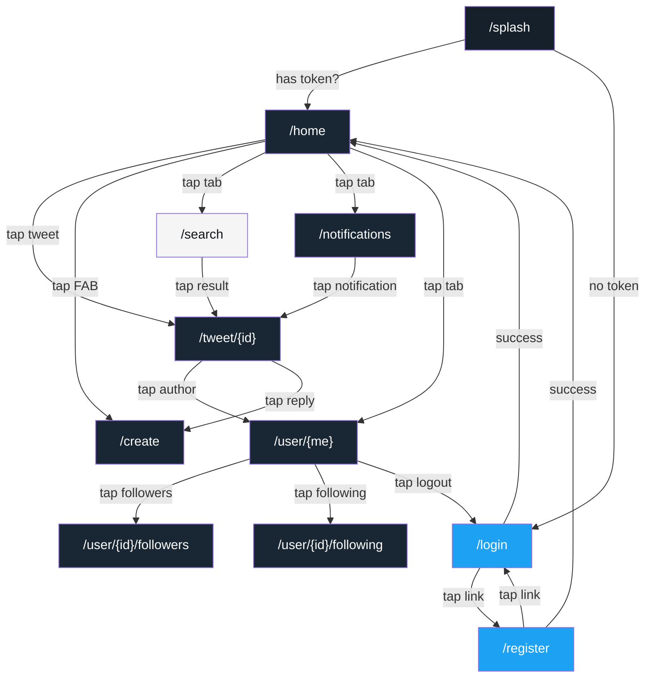
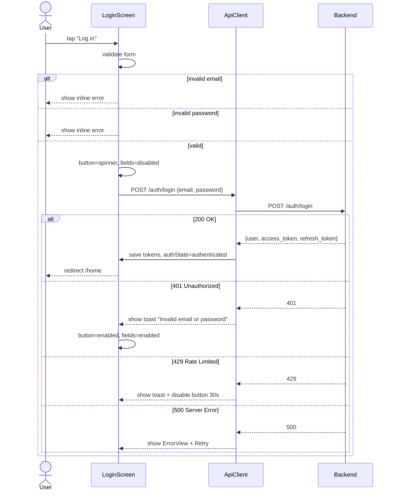
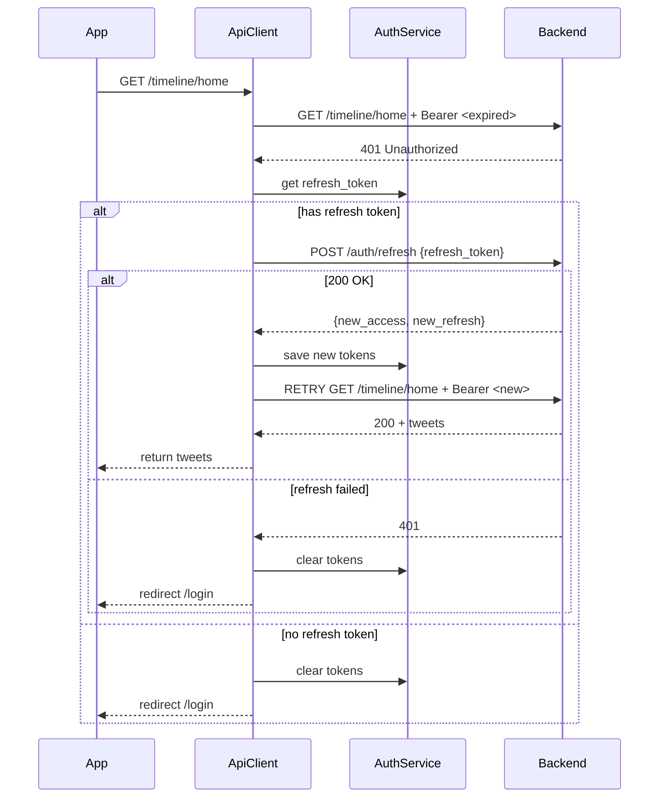
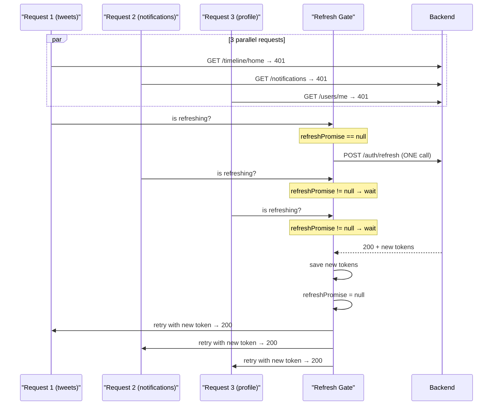
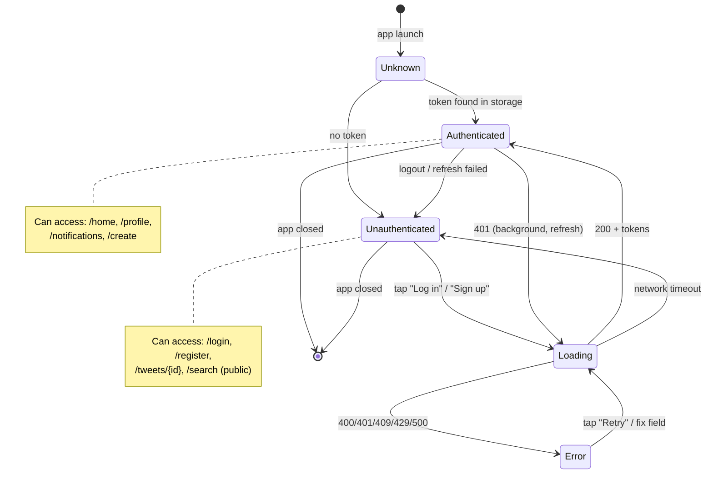
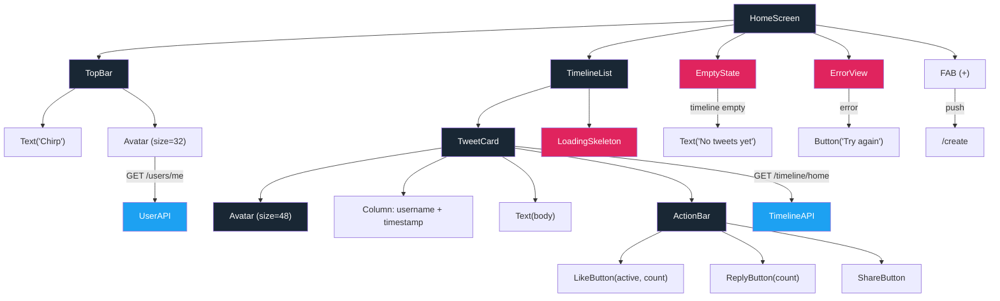
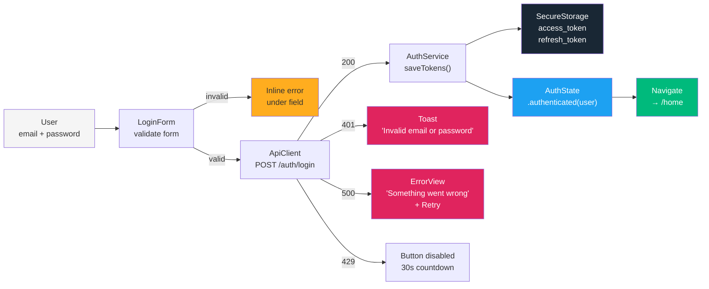
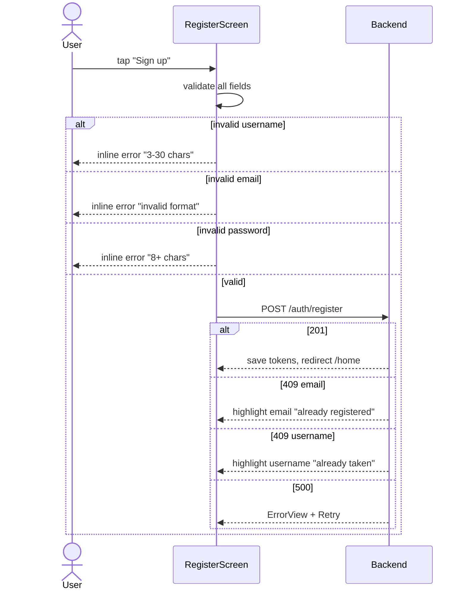

# Chirp — Diagrams

> Рендерящиеся диаграммы (Mermaid format).
> Читать в GitHub, Obsidian, VS Code с Mermaid plugin.
> Покрытие: screen flow, feature flow, state machine, component tree.

---

## 1. Screen Flow — Navigation Graph

> Как пользователь перемещается между экранами.



---

## 2. Auth Flow — Login Sequence

> Взаимодействие пользователя, UI, ApiClient и Backend при входе.



---

## 3. Auth Flow — Token Refresh

> Что происходит, когда access token протух.



### Race condition guard



---

## 4. Auth State Machine

> Все состояния авторизации и переходы между ними.



---

## 5. Component Tree — HomeScreen

> Из каких виджетов состоит HomeScreen и какие данные каждый получает.



---

## 6. Data Flow — LoginScreen

> Как данные трансформируются от ввода пользователя до сохранения токенов.



---

## 7. Auth — Register Flow (укороченная)



---

## 8. Auth Guard Decision Tree

> Логика AuthGuard при каждом переходе между маршрутами.

```mermaid
flowchart TD
    RouteChange["Route change"] --> CheckState{Check authState}
    
    CheckState -->|loading| Wait["Show spinner,<br/>don't redirect"]
    Wait --> CheckState
    
    CheckState -->|authenticated| CheckTarget{Target route}
    CheckTarget -->|/login or /register| RedirectHome["Redirect → /home"]
    CheckTarget -->|protected route| Allow["Show content"]
    
    CheckState -->|unauthenticated| CheckPublic{Is route public?}
    CheckPublic -->|yes: /tweets/{id}, /search| Allow
    CheckPublic -->|no: /home, /profile| RedirectLogin["Redirect → /login"]
    
    style RedirectHome fill:#1DA1F2,color:#fff
    style RedirectLogin fill:#E0245E,color:#fff
    style Allow fill:#00BA7C,color:#fff
    style Wait fill:#FFAD1F
```

---

## 9. Как использовать эти диаграммы

| Где открыть | Рендерится? |
|-------------|:-----------:|
| GitHub (.md file) | ✅ Автоматически |
| Obsidian | ✅ С Mermaid plugin |
| VS Code | ✅ С Mermaid preview |
| JetBrains IDE | ✅ С Markdown plugin |
| Любой Markdown viewer | ⚠️ Покажет сырой код Mermaid |

**Для редактирования:** любой текстовый редактор
**Для экспорта:** https://mermaid.live — вставить код → экспорт PNG/SVG
